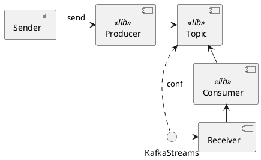
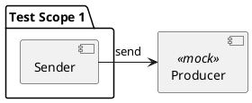
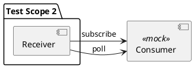
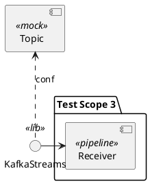
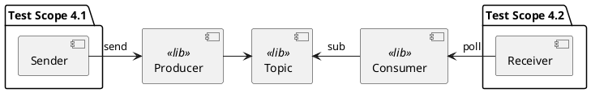
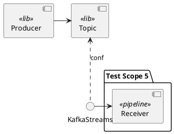

Разработка тестов для асинхронных приложений с Kafka
====================================================

Синхронный вызов
----------------

Асинхронный вызов
-----------------

Отправка сообщения
------------------

Получение сообщения: опрос
-------------------

Получение сообщения: обратный вызов
-------------------

Получение результата обработки: опрос
------------------------------

Получение результата обработки: обратный вызов
------------------------------

Получение результата обработки: ответное сообщение
------------------------------

Дизайн: варианты реализации
---------------------------
| Отправка сообщения | Получение сообщения | Получение результата | Получение ошибки   |
|--------------------|---------------------|----------------------|--------------------|
| Посылка сообщения  | Опрос               | Опрос                | Опрос              |
|                    | Обратный вызов      | Обратный вызов       | Обратный вызов     |
|                    |                     | Ответное сообщение   | Ответное сообщение |

---

Kafka
-----
- Broker
- Scaling and performance
- Topics

- "DB inside out" and durable log
- offset

Demo project structure
----------------------
- Test scopes
- Dependencies
- Snippets

Kafka @docker
-------------
- Images: confluentinc vs bitnami
- Externalized configuration
- Kafka client

Тест-дизайн: варианты покрытия и тест-дублеры
------------------------------

